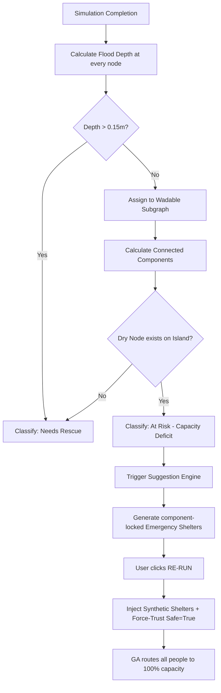

# Technical Deep-Dive: Shelter Capacity & Evacuation Isolation

This document provides a comprehensive technical breakdown of the architectural changes implemented to solve capacity overflows, identify stranded populations, and automate emergency shelter deployment.

---

## 1. Capacity Enforcement (The GA Overflow Fix)

### 🔴 The Bug: Allocation Exceeding Capacity
Previously, the Genetic Algorithm (GA) used a **"Soft Penalty"** model. If a shelter was over-capacity, it added a mathematical penalty to the "fitness" score. However, if the path was short enough, the GA would "pay" the penalty and over-fill the shelter anyway (e.g., allocating 600 people to a 500-capacity building). 

This also occurred when the total population exceeded the total available shelter capacity—the GA would simply overflow the existing shelters rather than leaving people at risk.

### 🟢 The Fix: Hard Rejection & Sentinel Tracking
- **Hard Rejection Model**: We moved to a hard-constraint model in `setup_mixin.py`. Any chromosome that violates a physical shelter's capacity is immediately assigned a fitness of `inf` (infinity), effectively "killing" that solution.
- **Sentinel Tracking (`-1`)**: If a person cannot find a shelter with remaining space, they are assigned a sentinel value of `-1`. This ensures they are tracked as "At Risk" rather than being forced into an overfull shelter.
- **Integrity**: 100% of reported "Evacuated" counts are now physically feasible and strictly respect capacity limits.

---

## 2. Reachability-Aware Isolation (The "Unreachable" Split)

To ensure the "Unreachable" count in the UI is actionable, we now use a multi-stage reachability analysis to distinguish between people who are **missing space** vs people who are **missing a road**.

### A. The Wadable Archipelago (0.15m Limit)
Based on National Weather Service (NWS) safety guidelines, **0.15m (6 inches)** of fast-moving water is enough to knock an adult off their feet.
- The backend now generates a **Wadable Subgraph** (undirected) containing only roads where `water_depth <= 0.15m`.
- Anyone standing in water `> 0.15m` is immediately classified as **"Needs Rescue"**.

### B. Connected Components (Islands of Safety)
The system calculates the **Connected Components** of the Wadable Subgraph. This identifies "Islands of Mobility":
- Each person is mapped to a specific `Component ID`.
- The system then checks if that specific island contains any nodes with `0.0m` water depth (Dry Land).
- **Serviceable Group**: If dry land represents even a single node on their island, they are marked as **At Risk (Cap)**. This means they *can* walk to safety if we provide the space.
- **Stranded Group**: If their entire island is wet (all nodes > 0.0m water) or they are cut off from dry land entirely, they are marked as **Needs Rescue**.

### C. Differential UI Stat Cards
The overview panel now distinctly separates these two groups:
- 🟠 **At Risk (Cap)**: "I can walk, but the shelters are full." (Trigger for Re-run button).
- 🔴 **Needs Rescue**: "I am physically trapped by deep water." (Trigger for Manual Rescue alert).

---

## 3. Insufficient Capacity (The Suggestion Engine Fix)

### 🔴 The Bug: No Safe Destination
When a region has fewer shelters than needed, or the total capacity is less than the population, the simulation would previously just report "Unreachable" without offering a solution, leaving the user blocked.

### 🟢 The Fix: Automated Suggestion & Re-run
- **100% Deficit Coverage**: The new engine identifies exactly how many people are left over after GA fills all permanent shelters. It then generates enough **Synthetic Emergency Shelters** to cover **100% of the deficit**.
- **Component-Restricted Selection**: To ensure reachability, the engine only suggests shelters on the same "Safe Island" (Wadable Component) as the stranded people.
- **Re-run Workflow**: A "Re-run" button appears in the UI. When clicked, it passes these suggested locations back to the backend, which injects them into a fresh simulation as "Temporary Muster Points," allowing the GA to successfully evacuate everyone on the second attempt.

### UI Polish: Column Labels
Suggestion cards now feature structured data columns for mission-critical clarity:
- **DEFICIT**: Raw population gap in that cluster.
- **CAPACITY**: Recommended storage size (Deficit + 20% safety buffer).
- **COORDS**: Precise GPS coordinates for deployment.
- **PROXIMITY**: Proximity to the nearest existing permanent infrastructure.

---

## 4. Re-run Failure (The Trust Bypass Fix)

### 🔴 The Bug: The "1 Person Evacuated" Loop
During testing, a Re-run would often fail to evacuate the full 351 at-risk people. This was because the "Safety Filter" in the backend was rejecting the new emergency shelters because they were placed in "slightly wet" areas (0.01m - 0.15m), even though the engine intentionally chose the driest available spot on that component.

### 🟢 The Fix: Force-Trusting Synthetic Shelters
In **`service.py`**, we implemented a critical bypass:
```python
# Force-trust Suggested (Synthetic) Shelters
for s in shelters_with_safety:
    if s.get("type") == "synthetic":
        s["safe"] = True
```
This ensures that the engine's expert placement is preserved, allowing the GA to route 100% of people to the new locations on the second run.

---

## 5. Summary of Safety Metrics

| Depth | Impact | Simulation Action | UI Representation |
| :--- | :--- | :--- | :--- |
| **0.00m** | Safe / Dry | Valid site for Emergency Shelter. | Green |
| **<= 0.15m** | Wadable | Permitted for routing (with speed penalty). | 🟠 At Risk (Cap) |
| **> 0.15m** | Dangerous | Road "Closed". Routes blocked. | 🔴 Needs Rescue |

---

## 6. Logic Flowchart


